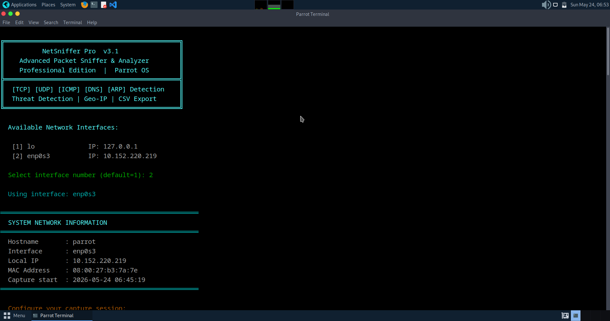
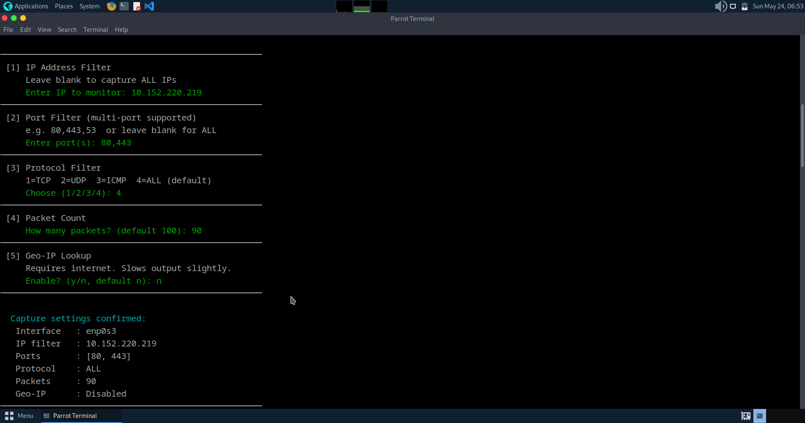
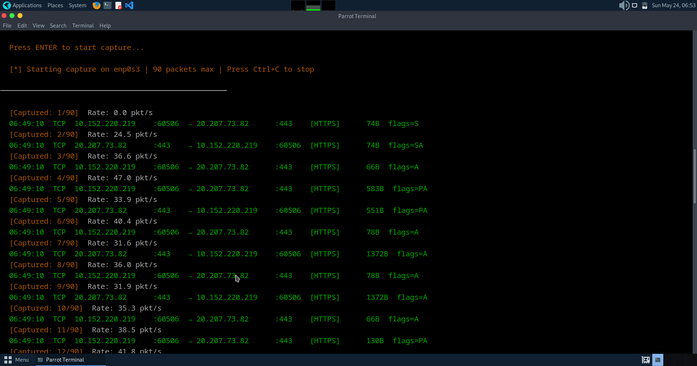
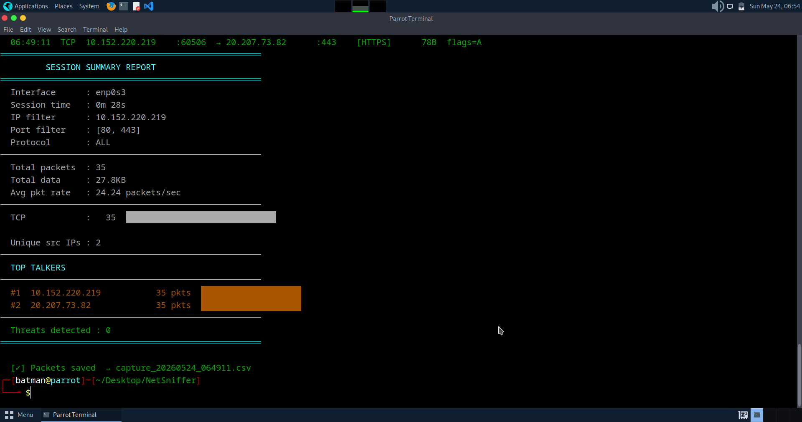

# NetSniffer Pro v3.1 🔐

A real-time network packet sniffer and threat detector built in Python on Parrot OS.


---

## Features

- Live packet capture with network interface selector
- Filter by IP address, port (multi-port), and protocol
- 30+ service labels (HTTP, HTTPS, SSH, FTP, MySQL, RDP...)
- Real-time threat detection:
  - Port scan detection
  - ARP spoofing detection
  - ICMP flood detection
- Geo-IP lookup (country/city of each IP)
- Live packet counter with rate monitor
- Top talkers report
- Session duration timer
- CSV export with timestamped logs
- Color-coded professional CLI output

---

## Requirements

- Parrot OS / Kali Linux / any Debian-based Linux
- Python 3.x
- Scapy
- Colorama

---

## Installation

```bash
git clone https://github.com/saisrujan1906-beep/NetSniffer-Pro.git
cd NetSniffer-Pro
pip install scapy colorama
```

---

## Usage

```bash
sudo python3 sniffer.py
```

Then follow the interactive menu:
1. Select your network interface
2. Set IP filter (optional)
3. Set port filter (optional, multi-port supported)
4. Set protocol filter (TCP/UDP/ICMP/ALL)
5. Set packet count
6. Enable/disable Geo-IP lookup

---

## Screenshots

### Startup & Interface Selection


### Configuration Menu


### Live Packet Capture


### Session Summary Report


---

## Project Structure

```
NetSniffer-Pro/
│
├── sniffer.py              # Main tool - packet capture & analysis
├── README.md               # Documentation
├── capture_*.csv           # Auto-generated packet capture logs
├── threats_*.csv           # Auto-generated threat detection logs
└── screenshots/
    ├── startup_banner.png  # Tool startup & interface selection
    ├── config_menu.png     # Configuration menu
    ├── live_capture.png    # Live packet capture output
    └── summary_report.png  # Session summary report
```

---

## Disclaimer

This tool is strictly for **educational and authorized network analysis only.**
Unauthorized interception of network traffic is illegal.
The author takes no responsibility for misuse of this tool.

---

## Author

**Sai Srujan**
- GitHub: [@saisrujan1906-beep](https://github.com/saisrujan1906-beep)
